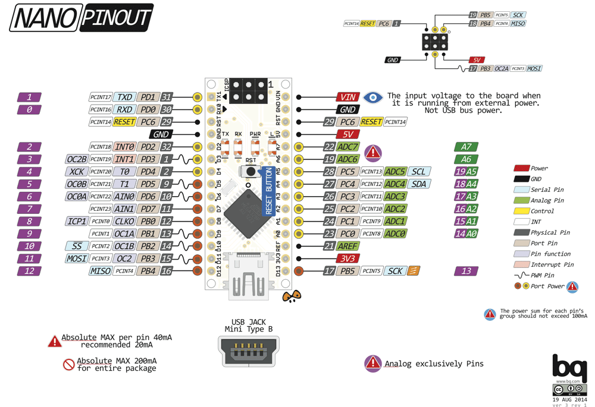

Arduino 101
===========

The following steps were performed to create this demo:

* Install the arduino IDE from https://www.arduino.cc
* Look at an arduino tutorial fx. https://www.brainy-bits.com/scroll-text-using-the-max7219-led-dot-matrix/
* Copy the text at the bottom and put it into a new "arduino-demo.ino" file
* Open this file in the arduino IDE. Conveniently by double clicking it
* Change the GPIO pin assignment. I use 11, 12 & 13 which is conveniently also available on the nano's ICSP header
* Dowload the required library(ies).
  I made a "libraries" subfolder for this and ```git submodule add```'ed the required library there (MaxMatrix) like so:
   ```cd libraries; git submodule add https://github.com/riyas-org/max7219.git```
* Now add libraries/max7219/MaxMatrix to the Arduino system under "Sketch" / "Include Library" / "Add .zip lirary ..."
  Don't worry, it will allow you to add a directory as well. 

Since i hate IDE's with a healthy heart, I will now create a saner CLI based environment
* Add an Arduino make wrapper. This one looks good:
  ```git submodule add https://github.com/sudar/Arduino-Makefile.git```
* Copy the Makefile from the "Blink" example and put in the parameters for board and MCU
* Add symlink to "MaxMatrix" under libraries, pointing to max7219/MaxMatrix
* Since my vim setup likes .cpp files better than .ino files, the bulk of the demo is moved to demo.cpp, demo.h
* And Bob's you uncle: You can do a ```make upload``` and see your reward scroll by .. Hooray!

Pinout of the nano


Final result
